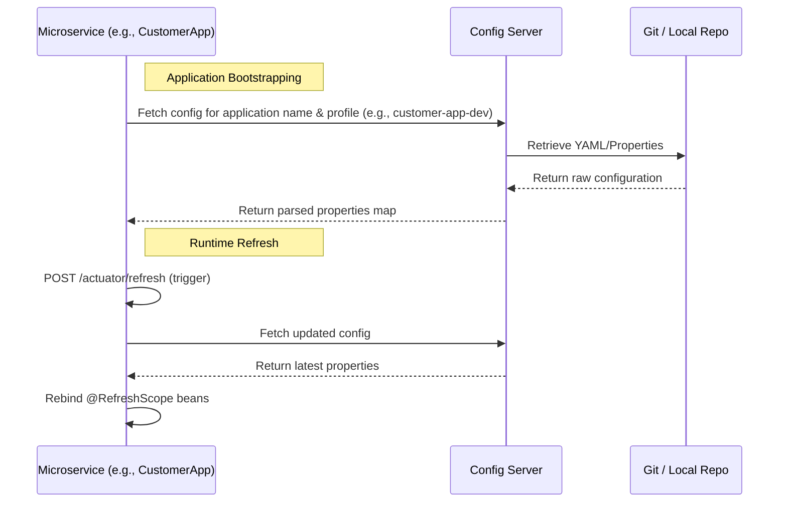

# ConfigService Architecture

The ConfigService provides a centralized, backend-agnostic configuration API for all microservices in the ecosystem. 

## Detailed Sequence Diagram

```mermaid
sequenceDiagram
    participant Microservice as Microservice (e.g., CustomerApp)
    participant ConfigService as Config Server
    participant GitRepo as Git / Local Repo

    %% Startup Flow
    note right of Microservice: Application Bootstrapping
    Microservice->>ConfigService: Fetch config for application name & profile (e.g., customer-app-dev)
    ConfigService->>GitRepo: Retrieve YAML/Properties
    GitRepo-->>ConfigService: Return raw configuration
    ConfigService-->>Microservice: Return parsed properties map
    
    %% Dynamic Refresh Flow
    note right of Microservice: Runtime Refresh
    Microservice->>Microservice: POST /actuator/refresh (trigger)
    Microservice->>ConfigService: Fetch updated config
    ConfigService-->>Microservice: Return latest properties
    Microservice->>Microservice: Rebind @RefreshScope beans
```
